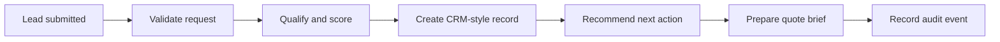

# Lead-to-Quote Automation Demonstrator

[](https://github.com/Lloyd-Lew/lead-to-quote-automation-demo/actions/workflows/ci.yml)

> A real, client-safe TypeScript API that validates a synthetic lead, qualifies it, creates a CRM-style record, recommends the next action, prepares a quote brief, and records a structured audit event.

This repository demonstrates the engineering approach behind a lead-to-quote automation system without using a customer workspace, integration, credential, record, result, or production URL. It is a working local service, not a static mock-up or a copy of client work.

## The business problem

When lead information is spread across forms, inboxes, spreadsheets, and separate sales tools, teams lose time deciding who should respond, what should happen next, and whether an opportunity is ready for a scoped conversation. This demonstrator shows a small but complete systems pattern: validate incoming context, make qualification logic explicit, create a traceable operational record, and prepare the next decision.

## What the API does



The project uses deterministic qualification rules rather than an external AI model. This makes the demonstration reproducible, inspectable, and safe to run without secrets. In production, an AI or external-system adapter could be introduced behind the same application boundary once security, data-handling, and human-review requirements are defined.

## Architecture and technology

The service uses Node.js, TypeScript, Express, Zod, Vitest, Supertest, ESLint, and GitHub Actions. The [architecture guide](docs/architecture.md) maps each running component to the codebase.

| Component             | Why it exists                                                                    |
| --------------------- | -------------------------------------------------------------------------------- |
| Express API           | Exposes a small HTTP boundary for lead intake and health checks.                 |
| Zod schema            | Rejects malformed or oversized inputs before workflow logic runs.                |
| Qualification engine  | Turns explicit commercial signals into a transparent score and tier.             |
| In-memory CRM adapter | Creates a real local record without a vendor credential or customer environment. |
| Quote-brief generator | Gives the next sales or solutions conversation an explicit starting point.       |
| JSON audit logger     | Makes workflow events traceable without logging a raw lead payload.              |

## Run locally

Use Node.js 20 or newer. The project has no required external services.

```bash
git clone https://github.com/Lloyd-Lew/lead-to-quote-automation-demo.git
cd lead-to-quote-automation-demo
cp .env.example .env
npm ci
npm run dev
```

The service starts at `http://localhost:3000`. Confirm health with `curl http://localhost:3000/health`.

## Run the primary workflow

Use the full [terminal demonstration](docs/demo-session.md), or submit the synthetic sample below.

```bash
curl --request POST http://localhost:3000/v1/leads \
  --header 'content-type: application/json' \
  --data '{"fullName":"Avery Singh","email":"avery.singh@example.test","company":"Northstar Advisory","teamSize":22,"monthlyBudgetUsd":5000,"urgencyDays":10,"interest":"automation","currentChallenge":"Lead follow-up, quoting, and handoffs are split across email and spreadsheets, so the team lacks visibility and spends too much time copying data."}'
```

The `201` response contains a generated CRM-style record ID, an evidence-based score and tier, a recommended owner and response window, a quote brief, and an audit-event ID. The result never claims a price, production CRM integration, or client outcome.

## Verify the project

```bash
npm run check
npm test
npm run build
```

The suite covers qualification tiers, next-action routing, workflow orchestration, application start-up, the valid API workflow, and invalid-input handling. CI repeats static checks, tests, build, and production-dependency auditing on every push and pull request.

## Security and data boundary

Only synthetic data is included. The repository contains no customer records, private workflow exports, API keys, token values, production URLs, or client screenshots. See the [security policy](SECURITY.md), [architecture guide](docs/architecture.md), [troubleshooting guide](docs/troubleshooting.md), and [technical review](docs/technical-review.md).

## Limitations and roadmap

The CRM adapter is intentionally non-persistent and resets when the service restarts. The qualification engine is deterministic to make the demo inspectable. A future iteration could add a local persistence adapter, a contract-tested CRM adapter, or a human-review queue—only when the work does not introduce client data or simulated production claims.

## Need something similar?

CompanyConnect.Tech designs custom CRM, automation, integration, dashboard, and AI-enabled operations systems around a business’s actual handoffs, controls, and measures. For business proof, see the [CompanyConnect Systems Portfolio](https://github.com/Lloyd-Lew/companyconnect-systems-portfolio). To discuss an operational bottleneck, use the [Operational Bottleneck Brief](https://github.com/Lloyd-Lew/companyconnect-systems-portfolio/blob/main/templates/operational-bottleneck-brief.md) or [book a strategy call](https://calendar.app.google/4SoivAXFkCpeQLVw5).

## Contributing and licence

Read [CONTRIBUTING.md](CONTRIBUTING.md) before suggesting a change. The source is available for evaluation under the [CompanyConnect Demonstrator Evaluation License](LICENSE.md); it is not a customer implementation or an open-source production starter.
