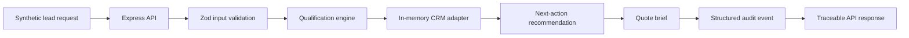

# Architecture

The demonstrator implements a complete local lead-to-quote workflow using synthetic input. It intentionally uses an in-memory CRM adapter so it can be inspected and run without credentials, external systems, or customer data.

| Layer       | Responsibility                                        | Implementation                    |
| ----------- | ----------------------------------------------------- | --------------------------------- |
| API         | HTTP boundary, validation responses, response headers | `src/api/app.ts`                  |
| Domain      | Qualification score, tier, next action, quote brief   | `src/domain/qualification.ts`     |
| Application | End-to-end workflow orchestration                     | `src/application/leadWorkflow.ts` |
| Adapter     | CRM-style record without external dependency          | `src/adapters/crmAdapter.ts`      |
| Logging     | Payload-minimised structured audit events             | `src/logging/auditLogger.ts`      |

The separation is intentional: a real CRM, AI service, quote service, or event store can later be introduced as an adapter without relocating business rules into the HTTP layer.
